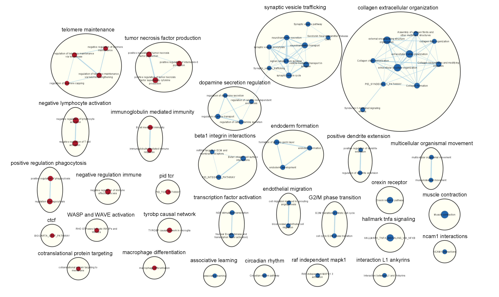
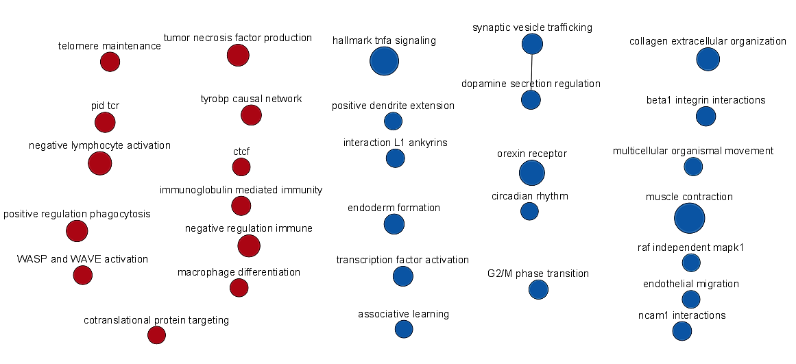
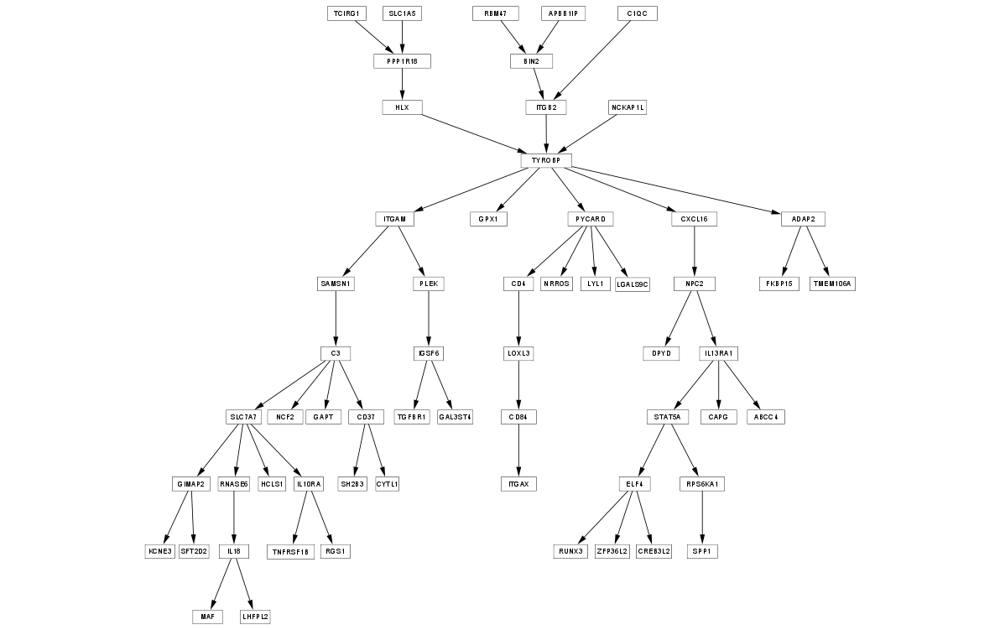

# Introduction

A dopamine imbalance in the human brain is one of the factors central to the pathogenesis of major psychosis. A study done by Pai et al. suggests that epigenetic changes may increase dopamine synthesis and result in psychotic symptoms. Psychosis is a typical symptom observed in patients with Schizophrenia and Bipolar disease. Furthermore, abnormal DNA methylation has been detected in patients with Schizophrenia and bipolar disorder. One of the important experiments performed in this paper was profiling the transcriptomes of neuronal nuclei samples from post-mortem frontal cortex of individuals diagnosed with Schizophrenia and Bipolar disease, as well as controls. Sequencing was done using High-throughput RNASeq. The purpose of this experiment was to determine the consequences of altered DNA methylation in major psychosis [@pai2019differential].

In the two previous studies, a dataset was chosen and the raw mRNA expression data was gathered from GEO [@barrett2012ncbi], cleaned up, normalized, and the gene identifiers were converted to HUGO symbols. The duplicate genes and genes with low counts were eliminated, then the data was normalized to account for technical variation. Next, significantly differentially expressed genes were identified from the set obtained in the first study, and a thresholded over-representation analysis was performed in order to determine the prominent themes in the gene set. The main themes discovered in this analysis were circadian rhythm, activation of complement pathway, synapse pruning, and neuronal development.

In the following study, a non-thresholded gene set enrichment analysis was performed to account for the genes that may be part of important pathways but not significantly differentially expressed. First, the genes were ranked from upregulated to downregulated, then an enrichment analysis was performed, and finally, the enrichment results were visualized and presented.


Chosen GEO dataset: [GSE112523](https://www.ncbi.nlm.nih.gov/geo/query/acc.cgi?acc=GSE112523)

Associated paper: [Differential methylation of enhancer at IGF2 is associated with abnormal dopamine synthesis in major psychosis](https://www.ncbi.nlm.nih.gov/pmc/articles/PMC6499808/)


# Procedure and Results

## Non-thresholded Gene set Enrichment Analysis

In the previous study, a thresholded gene set enrichment analysis was performed to determine what information the most significantly upregulated and downregulated genes can provide. The purpose was to identify pathways that are over-represented in these groups of genes. However, this analysis failed to consider that all the genes in between that are not significantly differentially expressed could provide a lot of important information. For example, a group of genes could be members of a pathway of interest, but only a few are upregulated or downregulated. But eventually, many weak signals along this pathway could lead to a strong signal. Therefore, in order to not lose this information, a non-thresholded gene set enrichment analysis was performed where all genes are part of the enrichment analysis and they are ordered by their rank. The rank is calculated by multiplying the strength of differential expression for each gene, then multiplying it by the sign of the gene's log fold-change. This results in a list where the most upregulated genes are at the top, the most downregulated genes are at the bottom, and in the middle are genes that are not differentially expressed.

To prepare for this analysis, in the previous work, a matrix was created containing the expression values of all the genes for control and Schizophrenia samples. Then, the Quasi-Likelihood method was used to calculated differential expression, and the gene list was sorted by p-value (most to least differentially expressed). This matrix was converted back to a dataframe to contain the Ensembl ID and gene name. This dataframe was saved to a file called qlf_output_hits_withgn.tsv, so, the first step was retrieving this table.


```{r}
qlf_output_hits_withgn <- read.table(file=file.path("./qlf_output_hits_withgn.tsv"),
                                    header = TRUE,sep = "\t",
                                    stringsAsFactors = FALSE,
                                    check.names=FALSE)
```

Next, a rank file was created. The rank of each gene was calculated, then the genes were ordered by their rank. The top of this list contains the most upregulated genes, at the bottom are the most downregulated genes, and in the middle are those genes that are not differentially expressed. A dataframe was created containing only gene names and their associated rank, then saved to a file for future input to GSEA.


```{r}
qlf_output_hits_withgn[,"rank"] <- 
  -log(qlf_output_hits_withgn$PValue,base =10) * sign(qlf_output_hits_withgn$logFC)

qlf_output_hits_withgn <- qlf_output_hits_withgn[order(qlf_output_hits_withgn$rank),]

rank_df <- data.frame(genename = qlf_output_hits_withgn$hgnc_symbol, F_stat = qlf_output_hits_withgn$rank)

ranked_genelist_filename <- "ranked_genelist.rnk"

write.table(rank_df,
            file= ranked_genelist_filename,sep = "\t",
            row.names = FALSE,col.names = FALSE,quote = FALSE)

```


```{r}
head(rank_df)
```

Figure 1a. Top few genes of the rank file. Contains genes that are upregulated in Schizophrenia.

```{r}
tail(rank_df)
```

Figure 1b. Bottom few genes of the rank file. Contains genes that are downregulated in Schizophrenia.

### What method of Non-thresholded Gene set Enrichment Analysis was used? What genesets were used?

The GSEA software (version 4.3.2) was chosen as the non-thresholded analysis method because it is very popular and has an interface that is easy to use, with no programming knowledge required. Given an a priori defined set of genes that share the same GO category or are part of the same pathway, the goal of GSEA is to determine whether the genes in this set are randomly distributed throughout the inputted ranked list, or if they are primarily found at the top or bottom [@subramanian2005gene].


Although there exists a resource, MSigDB, with many annotated gene sets for use in GSEA, for this analysis gene sets were pulled from the [Bader Lab geneset collection](http://download.baderlab.org/EM_Genesets/) instead [@reimand2019pathway]. The Bader Lab genesets get data from many different sources, such as GO, MSigDB, and Reactome. Since GO annotations are updated monthly, these genesets are also compiled on a monthly basis to have the most up to date annotations. In summation, the geneset used in this analysis was downloaded from the Bader lab collection because it contains more pathways, it is more robust, it is updated frequently, and it compiles the geneset into a GMT file, which is the format required for the GSEA software.


Within the Bader Lab collection, the following gene set was chosen [@reimand2019pathway] (Human, no IEA from April 2, 2023):

* Human gene set because this study looks at only human genes. 
* Gene symbol so that it matches with the HGNC symbols used in the data of this study.
* The most recent release of the gene set in order to have the most up to date annotations.
* GO biological process because pathway annotations are of interest (molecular function and cellular component gene sets would not have information on pathways).
* No IEA in order to get the best quality, curated data. 

Using the RCurl package [@rcurl2021], the following code was run to retrieve the desired gene set, and the file was saved for use in the GSEA analysis.


```{r}
if (!require("RCurl", quietly = TRUE)){
  install.packages("RCurl")
}
library("RCurl")

gmt_url = "http://download.baderlab.org/EM_Genesets/current_release/Human/symbol/"
# list all the files on the server
filenames = RCurl::getURL(gmt_url)
tc = textConnection(filenames)
contents = readLines(tc)
close(tc)
# get the gmt that has all the pathways and does not include terms inferred
# from electronic annotations(IEA) start with gmt file that has pathways only
rx = gregexpr("(?<=<a href=\")(.*.GOBP_AllPathways_no_GO_iea.*.)(.gmt)(?=\">)", contents, perl = TRUE)
gmt_file = unlist(regmatches(contents, rx))
```


```{r eval=FALSE}
dest_gmt_file <- file.path("./", gmt_file)
download.file(paste(gmt_url, gmt_file, sep = ""), destfile = dest_gmt_file)
```

Name of GMT file: `r gmt_file`

Name of ranked gene list file: `r ranked_genelist_filename`

To perform the non-thresholded gene set enrichment analysis, first, the GSEA desktop application was opened and "Run GSEA Preranked" was clicked. A preranked analysis was done because GSEA is designed for microarray data, whereas edgeR is optimized for RNASeq data. Therefore, it is preferred to use the ranked file created in the previous analysis because it provides a much more accurate ranking. Since a pre-ranked list is input to GSEA, it is not desirable that the phenotypes are shuffled, instead the gene set is permutated.

Next, the "Load Data" tab was clicked in the left navigation bar. Files `r gmt_file` and `r ranked_genelist_filename` were loaded. `r gmt_file` was chosen as the "Gene sets database", and `r ranked_genelist_filename` was chosen as the "Ranked List". The "Collapse/Remap to gene symbols" parameter was selected to be No_Collapse because the gene list contains symbols that matches the gene set database. The maximum gene set size was decreased to 200 because some of the pathways are very large and do not provide much information when it comes to annotations. Instead, smaller gene sets are desired because they give more specific and meaningful results. All other parameters remained as default. Finally, GSEA was run.


### Summary of Enrichment Results. How do these results compare to the results from the thresholded analysis. Is this a straight forward comparison? Why or why not?

A summary of the results is displayed below.


Since gene set sizes from 15 to 200 were used, this resulted in 5666 gene sets being included in the analysis. Out of these 5666 gene sets, approximately 65% are upregulated in the disease phenotype. The results also show that the proportion of gene sets enriched with a false discovery rate of less than 0.25 was much higher for the downregulated phenotype. Also, the proportion of gene sets significantly enriched at p-value less than 0.05 was higher in downregulated phenotype. 

Some of the top terms for genes that are upregulated in Schizophrenia were "TYROBP CAUSAL NETWORK IN MICROGLIA", "RHO GTPASES ACTIVATE WASPS AND WAVES", and "REGULATION OF PHAGOCYTOSIS". The top terms for genes that are downregulated in disease were "COLLAGEN CHAIN TRIMERIZATION", "ASSEMBLY OF COLLAGEN FIBRILS AND OTHER MULTIMERIC STRUCTURES", and "SYNAPTIC_VESICLE_TRAFFICKING". These terms are obviously different from the results obtained in the thresholded enrichment analysis. There may be terms that are similar and referring to the same pathways, but this is not a straightforward comparison. Firstly, the terms used in the different annotation sources like GO biological process, Reactome, and WikiPathways are not always the same. Second, these terms may be either more or less specific than the terms seen in the G:profiler results. Another reason might be because even if they had some of the same terms, they may have a different number of genes associated with the gene set, putting the gene set at a different spot in the results. Therefore, it would be difficult to come up with a way to do a one-to-one comparison of the terms. Although, there are some terms that were observed to be similar in the GSEA and G:profiler analysis such as terms relating to synapses, exocytosis, and neuronal cells.


## Visualizing the Gene set Enrichment Analysis in Cytoscape

To visualize the gene set enrichment analysis, the Cytoscape software (version 3.8.2) was used [@shannon2003cytoscape]. First, the Cytoscape desktop application was opened, then the EnrichmentMap Pipeline Collection was downloaded for use of apps like EnrichmentMap, WordCloud, and AutoAnnotate [@reimand2019pathway]. The EnrichmentMap app was then opened, and the resulting folder from the GSEA analysis was chosen as input. The software automatically loaded the appropriate report files for the na_pos phenotype, na_neg phenotype, the filtered GMT file containing only the genes found in the expression file provided to GSEA, and the ranked gene list. Additionally, the positive phenotype was named "Upregulated" and the negative phenotype was named "Downregulated".

### What thresholds were used to create this map?

The following parameters were chosen for the map [@reimand2019pathway]:

* "Filter genes by expression" was checked in order to exclude genes that are in the GMT file but not found in the expression file, otherwise, genes that are not part of the expression data would undesirably show up in the heatmap
* the FDR q-value cutoff was set to 0.05 because this is the commonly accepted significance cutoff
* the p-value cutoff was kept at the default of 1.0
* the connectivity was left in the middle of sparse and dense 
    * This metric determines if two gene sets (nodes) are connected based on their similarity, i.e. how many gene they have in common. When the connectivity is directly in the middle, it means that the Jaccard coefficient and the Overlap are weighted at 50% each. Additionally, the edge cutoff was left at 0.375, meaning that 37.5% of the genes are shared between the two nodes.


### How many nodes and how many edges are in the enrichment map?

Number of nodes in the enrichment map: 67

Number of edges in the enrichment map: 89

There are not too many nodes and the nodes are not overly interconnected, therefore the Q-value and similarity thresholds were not changed.

The initial network created in Cytoscape, before any adjustments, can be seen in the Figure 3 below.


The network was then manually adjusted in order to be more readable. See Figure 4.


### What parameters were used to annotate the network?

In order to make this EnrichmentMap more meaningful and easily interpretable, the gene sets were grouped together into themes. In the Apps tab in Cytoscape, the AutoAnnotate app was opened, and a new Annotation Set was created with default parameters. The cluster algorithm used was MCL Cluster, Adjacent words was chosen as the label algorithm, and the maximum words per label was left as 3. The Create singleton clusters checkbox was also selected because there was not an excess of nodes and themes, so the network would not have been overcrowded. It was also important to keep these because some of the most enriched gene sets are singletons, and these terms would be lost when collapsing the network in the future if they were not included. In order to make the results more meaningful, the word "Pathway" was added to the list of Excluded words. 

The cluster names were manually altered due to the presence of vague and/or uninformative terms. Some words that were removed include "involved", "primary", and "cell". Additionally, the order of words in some terms were rearranged and some were altogether changed to make more sense and be more descriptive.




### Publication Ready Figure


![Figure 6. EnrichmentMap network with annotated with major biological themes. Each node in the network represents a gene set/pathway that is enriched in upregulated or downregulated groups of genes. The blue nodes represent the gene sets enriched in genes that are downregulated in disease, and the red nodes represent the gene sets enriched in genes that are upregulated in disease. Each edge represents a similarity between two gene sets, i.e. how many genes they have in common. The size of the gene set determines the size of the node, and the thickness of the edge represents the size of the overlap. The gene sets are clustered together to represent the major biological theme that is common amongst them. The clustered gene sets are found inside the light yellow circles and each circle is labelled at the top with the name of the common theme.](./A3_images/prf_with_legend.png)


### Collapsing the network to a theme network: What are the major themes present in this analysis? Do they fit with the model? Are there any novel pathways or themes?

The network was collapsed to show only the major themes in the network. Then, the theme nodes were manually moved around to be closer to other similar themes. More specifically, for the upregulated gene sets, several terms involved with the immune system were put close together, such as "macrophage differentiation" and "immunoglobulin mediate immunity". Similarly, the term "PID TCR" and "negative lymphocyte activation" were put close together because they are both related to T cells [@liberzon2011molecular]. For the upregulated genes, examples include "orexin receptor" and "circadian rhythm" grouped because they are related to circadian cycles [@nattie2012respiration], "dendrite extension" and "interaction between L1 and ankyrins" grouped because they are both involved in neuron formation [@hortsch2009interaction], and "RAF independent MAPK1", "endothelial migration", and "NCAM1 interactions" grouped due to their involvement in cell migration [@gillespie2022reactome].




Major themes upregulated in disease:

* Telomere Maintenance
* TNF (Tumor Necrosis Factor) Production

Major themes downregulated in disease:

* Collagen Extracellular Matrix
* Synaptic Vesicle Trafficking
* Dopamine Secretion Regulation

These results fit the disease model as the genes that are supposed to regulate things like neurosignaling through synapses and dopamine synthesis are found to be downregulated. This matches the fact that these functions were discovered to be altered or dysregulated in samples from Schizophrenia patients. 

# Discussion

## Evidence to support findings

The goal of the original publication was to examine how hypomethylation of the enhancer within the IGF2 gene may enhance dopamine synthesis associated with major psychosis. The results detailed in the original paper are very similar to the results in this study. A pathway enrichment analysis in the original paper identified that deletion of IGF2 enhancer resulted in alterations in cell development, immune responses, neurodevelopment, and cytoskeletal remodeling. Likewise, this study found that genes that were upregulated in Schizophrenia patient samples are involved in immune responses, while the genes that were downregulated are involved in neuronal cell development. Additionally, in both the initial study and the current one, TNF-alpha signaling via NF-kB was found to be a top-ranking pathway enriched in genes downregulated in disease [@pai2019differential].

The most prominent terms in this analysis with support from the initial paper are Dopamine Secretion Regulation and Synaptic Vesicle Trafficking. Analysis of chromatin interactions in the prefrontal cortex revealed that the enhancer at IGF2 targets the promoter of tyrosine hydroxylase (TH), which is a rate-limiting enzyme for the production of dopamine. Dopamine dysregulation in the cortex of schizophrenia patients is known to be involved in the psychotic symptoms of this disease. Reduced DNA methylation at this enhancer was associated with elevated TH protein levels, demonstrating that this enhancer regulates dopamine synthesis [@pai2019differential]. These prior results are consistent with the gene set enrichment analysis results in this study indicating that the downregulated genes in schizophrenia patient samples are associated with the regulation of dopamine secretion.

After examining the effects of deleting the intergenic Igf2 enhancer in mice, the paper also found that synaptic proteins with the highest differential expression were involved in neurosignaling and structure, and synaptic vesicle release. Genes affecting synaptic plasticity and neurotransmitter release had been found to be dysregulated in the synaptosomal proteome of schizophrenia patients. It was concluded that the loss of the enhancer at Igf2 in mice disrupts synaptic proteins involved in neurotransmission and is associated with psychiatric disease [@pai2019differential]. Similarly, the downregulated genes in the current study were found to be involved in synaptic vesicle trafficking. Ultimately, this proves that the results in this analysis support conclusions made in the original paper.

Furthermore, these results align with the results from the preceding thresholded gene set enrichment analysis. Several pathways in the two studies are the same, such as those relating to synapse development, immune system, circadian rhythm, and exocytosis. There are some ways that these results differ. One way they differ is that the prior enrichment analysis showed many terms relating to the complement pathway, however, no terms in the non-thresholded analysis were associated with this pathway. Another example is that the results from the non-thresholded analysis showed a lot of association with TNF regulation, whereas this was not prominent in the thresholded enrichment analysis.


## Pathway investigation

### Why this pathway was chosen.

The TYROBP causal network in microglia pathway was chosen as it is the top ranking enriched pathway for upregulated genes in Schizophrenia, yet studies relating this pathway to the disease were hard to find. Interestingly, this same pathway was also found to be enriched in upregulated genes obtained from samples in other neurodegenerative diseases like Alzheimer's [@ma2015tyrobp] and Huntington's [@creus2022deletion]. Therefore, a more detailed idea of how this pathway relates to Schizophrenia was desired.

### Pathway Diagram

The WikiPathways [@martens2021wikipathways] app was installed in Cytoscape, then the pathway "TYROBP causal network in microglia" was imported to be visualized in the desktop application, see Figure 8. To annotate the pathway, a file containing the previously calculated log-fold change and p-value for every gene was imported into Cytoscape as well. Then, for Figures 9 and 10, the node fill colour was mapped based on the log-fold change and p-value, respectively.



### Annotated Pathway Diagram


It is evident that most of the genes in this pathway are significantly upregulated. This aligns with the results of the non-thresholded enrichment analysis since the pathway was enriched in upregulated genes.


# Conclusion

Non-thresholded gene set enrichment analysis can provide a lot of important and detailed information about the genes observed in diseases. These observations can help identify pathways that are altered in disease, allowing the potential for developing treatments that target these pathways in a way that they return back to their normal state. In this study, it was found that pathways for synaptic vesicle trafficking, dopamine synthesis, and TYROBP causal networks are altered in Schizophrenia, causing psychotic symptoms. These pathways could be a target for future drug development.


## References

